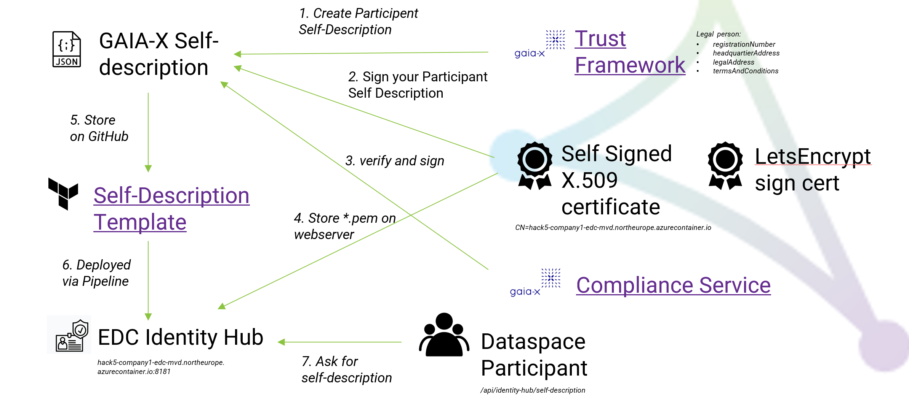

# GAIA-X Compliance

GAIA-X requires compliant Service-Descriptions for [legal and natural persons](https://gaia-x.gitlab.io/policy-rules-committee/trust-framework/participant/) in a dataspace. 

_Hint: The [Trust anchors](https://gaia-x.gitlab.io/policy-rules-committee/trust-framework/trust_anchors/) will sign the Self-Descriptions for productive dataspaces in the future._

On 26th/27th September 2022, the [5th Gaia-X hackathon](https://gitlab.com/gaia-x/gaia-x-community/gx-hackathon/gx-hackathon-5/-/wikis/home) guided
through the current status of the tools to sign and verify a Self-Description.

**GAIA-X provides the following services:**

- [GAIA-X Compliance](https://compliance.gaia-x.eu/v2206/docs/#/) (API for self-signing, normalizing and verifying a self-description)
- [GAIA-X Registry](https://registry.gaia-x.eu/v2206/docs/#/) (verification of X.509 certificate)
- [Example Store Self-descriptions](https://example-storage.lab.gaia-x.eu/)
- [DeltaDAO Self-description Signer](https://github.com/deltaDAO/self-description-signer/) (script)
- [Step-by-step Guide to create Self-Descriptions](https://gitlab.com/gaia-x/lab/compliance/gx-compliance/#how-to-create-self-descriptions)
- [Presentation about Self-Description](https://gitlab.com/gaia-x/gaia-x-community/gx-hackathon/gx-hackathon-5/-/wikis/uploads/20a463f1a3c79c3dd011755f75ca0652/2022-09-26_Session-03_Introductio-Self-Description.pdf)

The [Self-description schema](https://gitlab.com/gaia-x/lab/compliance/gx-registry/-/tree/2206-main/src/static/shapes/v2206) is defined as W3C SHACL Shapes in JSON-LD format.

## Current Status

As of now, the EDC project provides Gaia-X capabilities with
- the [Minumum Viable Data Space](https://github.com/eclipse-dataspaceconnector/MinimumViableDataspace) for a deployment of 3 participants and a Dataspace Authority
- the [Identity Hub](https://github.com/eclipse-dataspaceconnector/IdentityHub) for providing the Self-Description document with a trusted TLS certificate ([GAIA-X Compliance API](https://compliance.gaia-x.eu/v2206/docs/#/) requires the FQDN is part of the signed certificate by the Trust Authority)

The following scenarios are implemented in the [Identity Hub](https://github.com/eclipse-dataspaceconnector/IdentityHub):
- [X] Self-description for the Dataspace Authority can be retrieved from the IdentityHub of the **Dataspace Authority**.
- [X] Self-descriptions for dataspace participants can be retrieved form the IdentityHub of the **dataspace participants**.
- [X] **DID documents** contain the link to the corresponding self-description.
- [X] [Identity Hub's Self-description documentation](https://github.com/eclipse-dataspaceconnector/IdentityHub/tree/main/docs/developer/decision-records/2022-07-29-self-description)


_Fig. 1: Identity Hub API for retrieving self-descriptions_

Examples for a deployed Identity Hub Self-Description:
- [Company 1](http://hack5-company1-edc-mvd.northeurope.azurecontainer.io:8181/api/identity-hub/self-description)
- [Company 2](http://hack5-company2-edc-mvd.northeurope.azurecontainer.io:8181/api/identity-hub/self-description)
- [Company 3](http://hack5-company3-edc-mvd.northeurope.azurecontainer.io:8181/api/identity-hub/self-description)
- [Registration Service](http://hack5-registration-mvd.northeurope.azurecontainer.io:8181/api/identity-hub/self-description)

A [GitHub Action workflow](https://github.com/eclipse-dataspaceconnector/MinimumViableDataspace/blob/main/.github/workflows/deploy.yaml)
generates self-signed certificates `participantkey.pem` and uploads the private key to a cloud key vault:
```commandline
name: 'Request participant registration'
        run: |
          java -jar registration-service-cli.jar \
            -d did:web:$DATASPACE_DID_HOST \
            -c did:web:$PARTICIPANT_DID_HOST \
            -k participantkey.pem \
            participants add

az keyvault secret set --name "$name" --vault-name "$vault" --file authoritykey.pem -o none
az keyvault secret set --name "$CONNECTOR_NAME" --vault-name "$KEY_VAULT" --file participantkey.pem -o none
```
- signed Self-Description Terraform template for [Dataspace Authority](https://github.com/eclipse-dataspaceconnector/MinimumViableDataspace/blob/main/deployment/terraform/dataspace/sdd.tf)
- signed Self-Description Terraform template for [Participants](https://github.com/eclipse-dataspaceconnector/MinimumViableDataspace/blob/main/deployment/terraform/participant/sdd.tf)
- signed Self-Descriptions for [local deployment](https://github.com/eclipse-dataspaceconnector/MinimumViableDataspace/tree/main/system-tests/resources/self-description)

## Hands-on


_Fig. 2: GAIA-X Trust Workflow_

According to the provided [guide to create a Self-Description](https://gitlab.com/gaia-x/lab/compliance/gx-compliance/#how-to-create-self-descriptions),
you need to execute the following steps:

- Step 1: Create your Participant Self-Description.
- Step 2: Sign your Participant Self-Description.
- Step 3: Use the Compliance Service to verify and sign your Self-Description.
- Step 4: Finalize your signed Self-Description (see [how to set up certificates](https://gitlab.com/gaia-x/lab/compliance/gx-compliance/#how-to-setup-certificates)).

### Provide Self-Descriptions with signed X.509 certificates by a trust authority

- The MVD deployment should provide a signature with [Letsencrypt](https://letsencrypt.org/docs/client-options/) with the full FQDN of the container domain (e.g., `hack5-company1-edc-mvd.northeurope.azurecontainer.io`).
- The self-description needs to be delivered via HTTPS on port 443 by the Identity Hub.
- Need to store the returned `.pem` file into the www-root folder to show the certificate of the trust authority.
- Currently, the MVD has 3 static participants. If new participants are dynamically onboarded, the Registration Service provides a self-description verification, calling the [GAIA-X  Compliance verify service](https://compliance.gaia-x.eu/v2206/docs/#/Participant/ParticipantController_verifyParticipant).

### Next steps to create and sign valid self-descriptions

1. Modify the [Self-Description templates](https://github.com/eclipse-dataspaceconnector/MinimumViableDataspace/tree/main/deployment/terraform) and add the required attributes `registrationNumber`, `headquarterAddress`, `legalAddress`, `termsAndConditions `of legal persons from the [GAIA-X Trust Framework](https://gaia-x.gitlab.io/policy-rules-committee/trust-framework/participant/#legal-person).
2. Create self-signed X.509 certificates with [OpenSSL](https://linuxize.com/post/creating-a-self-signed-ssl-certificate/) for company 1, company 2, company 3, Registration Service:
```commandline
openssl req -newkey rsa:4096 -x509 -sha256 -days 3650 -nodes -out edc-company1.crt -keyout edc-company1.key -subj "/C=DE/ST=Berlin/L=Berlin/O=Eclipse Foundation/OU=EDC community/CN=hack5-company1-mvd.northeurope.azurecontainer.io"
```
4. You need to be the owner of the FQDN domain to get a signed SSL certification with the private X.509 key and certificate, issued by a trusted authority like [letsencrypt.com](https://letsencrypt.org/) (see also [list of trusted verifier](https://gaia-x.gitlab.io/policy-rules-committee/trust-framework/trust_anchors/)).
5. Use the full FQDN (e.g., `hack5-<CONTAINER>-mvd.northeurope.azurecontainer.io`).
6. Sign the self-description files with the [Self-description Signer](https://github.com/deltaDAO/self-description-signer/) script for the four domains with the full FQDN domains.
7. Follow the instruction to [Enable TLS for WebServer Azure Container Instances](https://learn.microsoft.com/en-us/azure/container-instances/container-instances-container-group-ssl) for each container.
8. Upload the PEM file to the www-root of each container.

## Notes
- For local developments, you cannot certify IP addresses by a trust authority.
- The Identity Hub is providing the static Self-description files via public endpoints.
- See [EDC recommendations for communicating via TLS](https://github.com/eclipse-dataspaceconnector/DataSpaceConnector/tree/main/extensions/common/http/jetty#terminate-ssl-in-the-connector-runtime).

